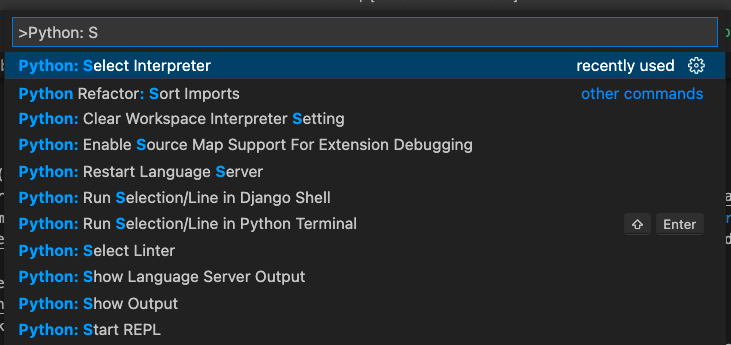
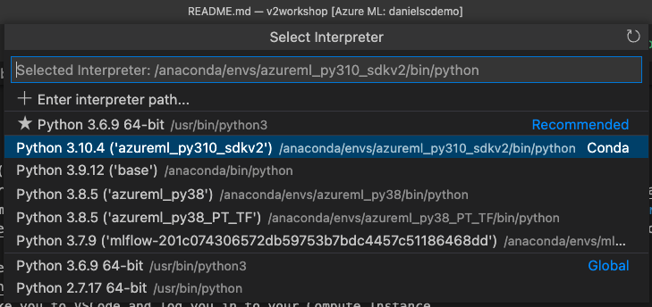
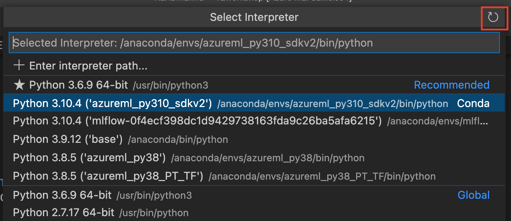
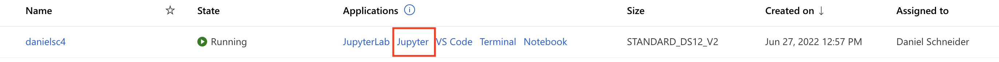
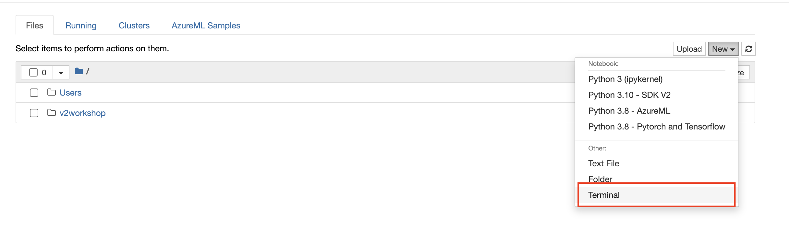
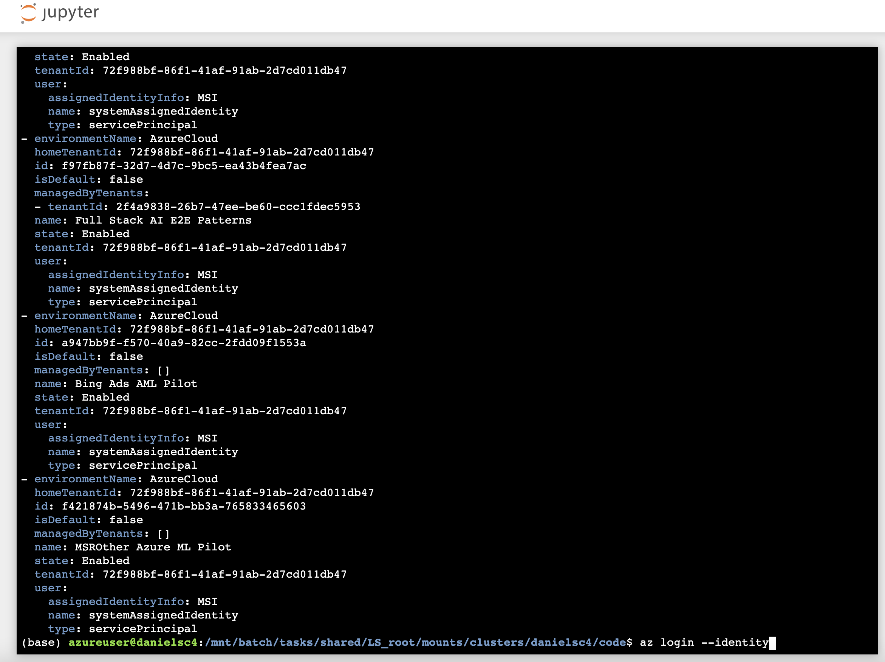

# AzureML v2 CLI Workshop

## Setup before the Workshop

1. Have an AzureML workspace (or create one at: https://ml.azure.com/) 
2. Install VSCode (get it here: https://code.visualstudio.com/download)
3. Install the AzureML VSCode Extension (get it here: https://marketplace.visualstudio.com/items?itemName=ms-toolsai.vscode-ai)
2. Create a new Compute Instance (to make sure you have the latest changes already on the machine). <br>Instructions are [here](https://docs.microsoft.com/en-us/azure/machine-learning/how-to-create-manage-compute-instance?tabs=azure-studio#create) -- no need to change any settings; leave everything to defaults.
2. Once the compute instance has been created, click on the VSCode link
    <br>
    <br>That should take you to VSCode and log you in to your Compute Instance.
2. Start a terminal with `Terminal / New Terminal` and type the following:
    <br>Make sure conda is working
    ```
    conda init bash
    ```
    <br>This will make the CLI output prettier
    ```
    az config set core.output=yamlc
    ```
    <br>This will log your CI into Azure the identity you used to log into the CI 
    ```
    az login --identity
    ```
    <br>Test that you are properly logged in:
    ```
    az ml compute list -o table
    ```
    <br>This should give you a list like this:
    ```
    Name       Compute type     State    Instance type
    ---------  ---------------  -------  ----------------
    danielsc4  computeinstance  Running  STANDARD_DS12_V2
    ```
7. Clone this repo:
    ```
    git clone https://github.com/danielsc/v2workshop.git
    ```
8. Open the v2workshop folder in VSCode
   <br>
   <br>
   <br>This will reload the folder in VSCode
2. Last, set your Python interpreter by hitting Shift-Ctrl-P (Windows) / Shift-Cmd-P (Mac) and then typing `Python: Select Interpreter`. 
    <br>
    <br>
    <br>Now select `azureml_py310_sdkv2`
    <br>
    <br>Then start a new Terminal and install Scikit-Learn, etc.
    ```
    pip install -r src/requirements.txt 
    ```
## Troubleshooting

**Also see reported issues here: https://github.com/danielsc/v2workshop/issues**

1. Cannot find resource group / workspace
    <br>If `az ml compute list`
    <br>gives you the error `resource group could not be found`
    <br>Then you need to set your default subscription with 
    ```
        az account set -s <subscription_id>
    ```
2. When trying to `Python: Select Interpreter` no envrionments are show.
    <br>In some cases, hitting the refresh button on the top right has helped.
    <br>

2. When `az login --identity` does not succeed
    <br>In this case, you will need to log in to the compute instance via jupyter
    <br>
    <br>
    <br>


